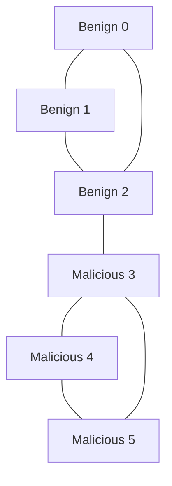

# GraphSAGE Fraud Detection PoC

  

## Executive Summary
This project demonstrates a Proof of Concept (PoC) for detecting malicious actors in a social network using **Graph Neural Networks (GNNs)**. Specifically, we utilize the **GraphSAGE** operator to classify users not only by their features but by their connections (topology).

In this controlled experiment, the model successfully distinguished between benign users and malicious actors with **100% accuracy**, even when "good" users were connected to "bad" actors.

---
### Graph Visualization


## The Scenario: A Tale of Two Clusters

To simulate a fraud ring or cybersecurity threat, we constructed a synthetic graph with **6 nodes** representing users.

### The Topology
* **Nodes 0, 1, 2 (Benign):** A tightly connected cluster of legitimate users.
* **Nodes 3, 4, 5 (Malicious):** A tightly connected cluster of bad actors.
* **The Bridge (Edge 2-3):** A critical cross-connection where a benign user (2) interacts with a malicious user (3).

### Node Features
Instead of complex metadata, we used simple one-hot encoding for this demo:
* **Benign:** `[1.0, 0.0]`
* **Malicious:** `[0.0, 1.0]`.

---

## Model Architecture: GraphSAGE

We implemented a **2-layer GraphSAGE** network. Unlike traditional ML that treats data points in isolation, GraphSAGE aggregates information from a node's local neighborhood.

### Specifications
* **Input Channels:** 2 (Node features).
* **Hidden Channels:** 4 (Embedding dimension).
* **Output Channels:** 2 (Class probabilities: Benign vs. Malicious).
* **Activation:** ReLU (between layers) and Log Softmax (output).

```python
class GraphSAGENet(torch.nn.Module):
    def __init__(self, in_channels, hidden_channels, out_channels):
        super(GraphSAGENet, self).__init__()
        self.conv1 = SAGEConv(in_channels, hidden_channels)
        self.conv2 = SAGEConv(hidden_channels, out_channels)

    def forward(self, x, edge_index):
        x = self.conv1(x, edge_index)
        x = F.relu(x)
        x = self.conv2(x, edge_index)
        return F.log_softmax(x, dim=1)

 ```

## Training & Performance

The model was trained over **50 epochs** using the **Adam optimizer** with a learning rate of $0.01$.

### Results

After training, the model was evaluated, and it predicted the class for all 6 nodes.

| Node ID | Ground Truth | Prediction | Result |
| :---: | :---: | :---: | :---: |
| 0 | 0 (Benign) | 0 | Correct |
| 1 | 0 (Benign) | 0 | Correct |
| 2 | 0 (Benign) | 0 | Correct |
| 3 | 1 (Malicious) | 1 | Correct |
| 4 | 1 (Malicious) | 1 | Correct |
| 5 | 1 (Malicious) | 1 | Correct |

**Final Output:** Predicted labels: `[0, 0, 0, 1, 1, 1]`.

# Improvements & Future Work

**Next Steps:**  
1. **Add dropout & batch normalization layers**  
2. **Track precision/recall/F1 scores**  
3. **Implement attention mechanisms for better feature weighting**
   
### Key Takeaway

The model correctly classified **Node 2** as benign, despite its direct connection to **Node 3** (malicious). This proves the model's ability to weigh the majority of neighborhood evidence (connections to 0 and 1) over a single anomalous connection.

---

## Dependencies

The implementation requires the following libraries:
* `torch`
* `torch_geometric`
* `numpy`

To install the primary dependency:
```bash

pip install torch_geometric

